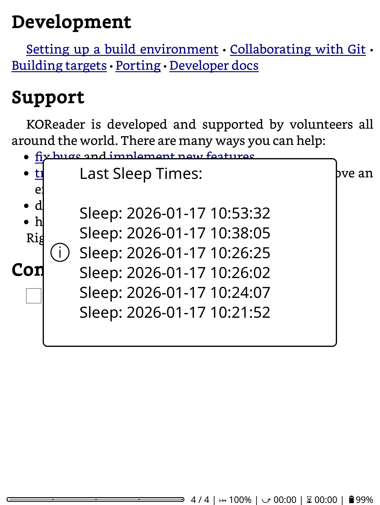

# Koreader Plugin For Sleep Mode Tracking

Logs the last sleep times of the device to a file and makes them available via an info message popup.

**Features:**

- Automatically logs sleep time when device suspends
- Stores only last 6 sleep times (no wake times)
- Accessible via menu item
- Gesture support for quick access
- Simple text file format for easy debugging
- Works across device restarts
- Tested on pocketbook era color

  

## Installation

1. Create the plugin directory structure:

   - Navigate to your KOReader plugins folder: koreader/plugins/
   - Create a new folder: sleeplogger.koplugin

2. Add the files:

   - Place _meta.lua in koreader/plugins/sleeplogger.koplugin/_meta.lua
   - Place main.lua in koreader/plugins/sleeplogger.koplugin/main.lua

3. Enable the plugin:

   - Restart KOReader
   - Go to Tools → More tools → Plugin management
   - Enable "Sleep Logger"
